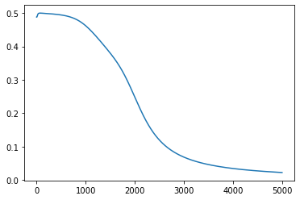

# Neural-Network-Architecture-from-scratch
Designing Neural Network Architecture from scratch to train XOR gate

# XOR inputs

*First columns define the bias of the Neural Network Input layer and last two columns define XOR gate input to the Neural Network.*
x=np.array([[1,-1,-1],
            [1,-1,1],
            [1,1,-1],
            [1,1,1]])

# XOR Outputs

y=np.array([[0],[1],[1],[0]])

# Architecture adjustable parameters

#hidden layer = 1

i=2  #number of input neurons excluding bias

j=5  #number of hidden neurons excluding bias 

o=1  #number of output neurons

